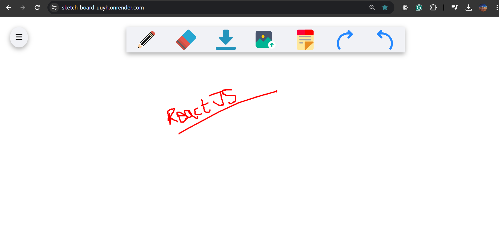

# Sketch-Board

#### The Sketch Board web application is a collaborative digital whiteboard platform built with socket.io designed to brainstorm, share ideas, and work on visual projects in real-time. It provides a virtual canvas where users can draw and erase, add sticky notes, and download whatever they draw fostering creativity and collaboration among team members.

# Tech Stack -

#### Client - HTML, CSS, Javascript

#### Server - ExpressJS

#### Real-Time Communication - Socket.io

## Demo

https://sketch-board-uuyh.onrender.com/

# Features

#### A variety of drawing tools are available, including pens, an eraser, an undo option, a redo option, a download option, an upload file option, and sticky notes option, enabling users to express their ideas visually.

https://github.com/Vishnu-Murti-Pandey/Sketch-Board/assets/53193912/e36d2def-fa54-4369-8ee0-2bb530dc8bf2

# Installation

#### How to establish the backend(server) connection & start the server

1. npm init -> to install package.json
2. Install express & scoket.io
3. Initallize the server(create port number & start listening the server)
4. To listen run the command node app.js
5. Connect the socket in frontend with cdn, you will get the response in the backend and now make the connection
6. Now, connect the index.html file with the server to render the page.

Server to connect locally -> <a href="http://localhost.5000">http://localhost.5000</a>
